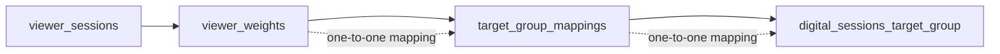

# Data Model

## Relationship: viewer_sessions -> viewer_weights -> target_group_mappings -> digital_sessions_target_group

## Interpretation

This relationship describes a strict lineage of demographic and weighting logic:

- Each record in `viewer_sessions` is associated with a corresponding weight in `viewer_weights`.
- That weight is then mapped through `target_group_mappings` to a target-group definition.
- That target-group definition corresponds to a single record in `digital_sessions_target_group`.
- The key assumption is that this path is effectively a one-to-one map rather than a many-to-many relationship.

## Business meaning

- `viewer_sessions` captures the observed session-level behavior of synthetic viewers.
- `viewer_weights` stores the representational weight needed to scale or activate synthetic viewers.
- `target_group_mappings` aligns those viewers to demographic or target-group buckets.
- `digital_sessions_target_group` is the digital equivalent used to compare or match digital sessions against the synthetic viewer structure.

## Why it matters

This structure ensures that demographic assignment, weighting, and session representation remain consistent across the synthetic and digital layers. It allows the model to preserve comparability for KPIs while enforcing that each synthetic viewer or mapped unit belongs to exactly one relevant demographic target group at each stage.
